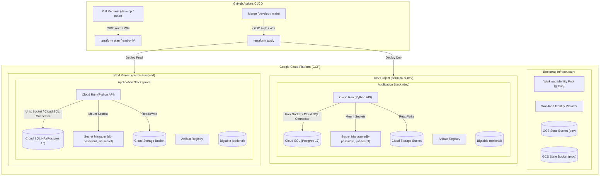

# permica-ril-infra

Terraform for a Python API on Google Cloud, with separate **dev** and **prod**
environments that a team can share safely.

Per environment (each in its own GCP project, with its own state bucket):
Cloud Run · Cloud SQL (PostgreSQL 17) · Cloud Storage · Bigtable (optional) ·
Secret Manager · Cloud Scheduler · Artifact Registry · service accounts ·
GitHub → GCP authentication via Workload Identity Federation (no JSON keys).

```text
.
├── bootstrap/            # Run ONCE by human: GCP projects, state buckets, GitHub OIDC & CI SAs
├── modules/              # Reusable Terraform modules
│   ├── apis/             # GCP API enablement
│   ├── artifact-registry/# Docker image registry
│   ├── bigtable/         # Cloud Bigtable instances & tables
│   ├── cloud-run/        # Cloud Run microservice deployment
│   ├── cloud-sql/        # Cloud SQL (PostgreSQL 17) database
│   ├── cloud-storage/    # Cloud Storage buckets
│   ├── iam/              # IAM service accounts & role bindings
│   ├── scheduler/        # Cloud Scheduler cron jobs
│   ├── secret-manager/   # Secret Manager secrets
│   └── stack/            # Composes all modules into a full environment stack
├── environments/         # Environment configurations
│   ├── dev/              # Dev layer (calls modules/stack with disposable settings)
│   └── prod/             # Prod layer (calls modules/stack with HA & scaling settings)
├── scripts/              # Automation helper bash scripts (update/delete GitHub & app vars, fetch secrets)
│   ├── bootstrap.sh
│   ├── delete_github_vars.sh
│   ├── get_secret.sh
│   ├── update_app_github_vars.sh
│   └── update_github_vars.sh
├── .github/workflows/    # CI/CD pipelines (terraform-dev.yml, terraform-prod.yml)
└── docs/                 # Guides & example workflows (app deployment, component upgrades)
```

## Architecture Diagram



## How several people share it safely

| Concern | How it is handled |
|---|---|
| One account, two environments | Two GCP projects (`*-dev`, `*-prod`) under the same billing account. Separate state, IAM and blast radius. |
| Two people running Terraform at once | Remote state in GCS with locking; CI serialises runs per environment. |
| Who can change infrastructure | Only CI. Humans open PRs. Dev applies on merge to `develop`; prod applies on merge to `main` **after a reviewer approves** the `production` GitHub Environment. |
| Who can touch prod from GitHub | The prod apply identity only accepts tokens from *this repo* on branch *main*. Forks get nothing. |
| Onboarding a teammate | Add them to a Google Group listed in `terraform.tfvars` (`developer_members` / `admin_members`). Devs get deploy + logs in dev, **read-only in prod**. |
| Credentials | No service-account keys anywhere. GitHub OIDC only. |
| Secrets | Terraform creates the secret containers and the generated DB password. Other values are added out-of-band, never committed. |

## One-time setup

You need: `gcloud`, Terraform ≥ 1.9, a GCP billing account, and a GitHub repo for this code
(branches `main` and `develop`).

1. **Authenticate**
   ```bash
   gcloud auth login
   gcloud auth application-default login
   ```
   Your user needs *Billing Account User* on the billing account (and *Project Creator*
   on the org/folder if you use one). If Terraform complains that an API "has not been
   used in project …", enable `cloudresourcemanager`, `serviceusage` and `cloudbilling`
   on your quota project, or run
   `gcloud auth application-default set-quota-project <an-existing-project>`.

2. **Bootstrap**
   ```bash
   cd bootstrap
   cp terraform.tfvars.example terraform.tfvars   # edit: app name, billing account, project IDs, github repo
   cd ..

   # Option A: Provision a SINGLE environment (e.g. dev):
   ./scripts/bootstrap.sh dev

   # Option B: Provision ALL environments (dev & prod):
   ./scripts/bootstrap.sh
   ```
   This provisions the GCP project, state bucket, GitHub OIDC trust, and CI service accounts for the targeted environment(s), and generates `environments/<env>/backend.tf`. To use an existing project, run `terraform import 'google_project.env["dev"]' <project-id>` first.

3. **Tell GitHub about it**
   - Set variables via helper script or `gh` CLI:
     ```bash
     ./scripts/update_github_vars.sh
     # to undo / remove set variables:
     ./scripts/delete_github_vars.sh
     ```
     *(Or manually in Repo → Settings → Secrets and variables → Actions → **Variables**).*
   - Settings → Environments → create **`production`** and add required reviewers.
   - Settings → Branches → protect `main` and `develop` (require PR + review; add a CODEOWNERS
     file for `environments/prod/` and `modules/`).

4. **Fill in the environments**
   Edit `environments/dev/terraform.tfvars` and `environments/prod/terraform.tfvars`
   (project IDs must match step 2; put your team's Google Groups in the member lists).
   Commit everything, including the generated `backend.tf` files.

5. **First deploy — through CI**
   Push/merge to `develop` (creates dev), then open a PR `develop → main` and merge it
   (creates prod after approval). Some IAM bindings take a minute to propagate; if the first
   apply fails with a permission error, re-run the workflow.

## Day to day

- Change infra → branch → PR to `develop` → the PR shows a `terraform plan` in the run
  summary → merge → dev updates. When happy, PR `develop → main` → review the prod plan →
  merge → approve → prod updates.
- Format before committing: `terraform fmt -recursive`.
- Terraform never redeploys your application. CI owns the running image (Terraform ignores
  image changes on Cloud Run). Use `docs/deploy-app.example.yml` in your app repo.
  `terraform output app_deploy_github_variables` (in each environment folder) prints the values it needs.
- **Sync Application Repo Variables**:
  Set/update application repository GitHub Action variables (e.g., for `permica-core`) using:
  ```bash
  ./scripts/update_app_github_vars.sh <target-repo> [dev|prod]
  # Example:
  ./scripts/update_app_github_vars.sh Vijay-E-Permica/permica-core dev
  ```

## Secrets

- `db-password`: generated by Terraform and mounted into Cloud Run as `DB_PASSWORD`. It also exists in the
  Terraform state, so keep the state buckets locked down (only the CI service accounts have access).
- Your own secrets (default list: `jwt-secret`, change via `app_secrets`) are created **empty**. Add a value:
  ```bash
  printf '%s' "$VALUE" | gcloud secrets versions add jwt-secret --data-file=- --project <project-id>
  ```
  Then expose it to the service by adding `extra_secret_env = { JWT_SECRET = "jwt-secret" }`
  to that environment's `terraform.tfvars`. (Add it only after a version exists, otherwise the Cloud Run revision fails.)
- **Fetch secret value**:
  Use the provided script to retrieve secret values from GCP Secret Manager:
  ```bash
  ./scripts/get_secret.sh <secret-name> <project-id> [version]
  # Example:
  ./scripts/get_secret.sh jwt-secret permica-ai-dev-134567 latest
  ```


## Environment variables your app receives

Terraform automatically injects the following environment variables into your Cloud Run container at runtime. Your Python app can access them directly (e.g. `os.getenv("DB_PASSWORD")`).

| Variable | Description | Usage |
|---|---|---|
| `ENVIRONMENT` | Target environment (`dev` or `prod`) | Runtime environment flags or logging levels |
| `GCP_PROJECT` | GCP Project ID | Configuring GCP SDK clients |
| `DB_INSTANCE_CONNECTION_NAME` | Cloud SQL instance connection string (`project:region:instance`) | Cloud SQL socket connection target |
| `DB_SOCKET_DIR` | Unix domain socket directory (`/cloudsql`) | DB connection socket directory |
| `DB_NAME` | PostgreSQL database name | Database name to connect to |
| `DB_USER` | PostgreSQL user account | Database user login |
| `DB_PASSWORD` | PostgreSQL password *(Mounted from Secret Manager)* | DB authentication password |
| `STORAGE_BUCKET` | Dedicated GCS bucket name | Application file storage & asset uploads |
| `BIGTABLE_INSTANCE_ID` | Bigtable instance ID *(Optional)* | Bigtable client connection *(when enabled)* |

> **Connecting to PostgreSQL**: Connect over the unix socket `/cloudsql/<DB_INSTANCE_CONNECTION_NAME>`.


## Cost notes

Key infrastructure settings configured to prevent unexpected GCP billing charges:

| Component | Dev Configuration | Prod Configuration | Cost Impact / Notes |
|---|---|---|---|
| **Bigtable** | Disabled (`enable_bigtable = false`) | Optional (`enable_bigtable = true`) | Bigtable bills ~24/7 per provisioned node (~$300+/mo per SSD node). Kept OFF in `dev` by default. |
| **Cloud SQL** | Single-zone (`db-f1-micro`) | Regional High-Availability (`db-custom-2-7680`) | Prod runs HA failover instance for reliability; dev runs low-cost micro tier. |
| **Cloud Run** | Scales to `0` (`min_instances = 0`) | Keeps warm (`min_instances = 1`) | Dev incurs zero compute costs when idle; prod stays warm to avoid cold starts. |

> **Cost Optimization & Sizing Tip**: Adjust instance sizes and scaling parameters in `environments/dev/terraform.tfvars` and `environments/prod/terraform.tfvars` based on actual traffic requirements. For step-by-step instructions on scaling Cloud SQL tiers, disk space, or compute resources without data loss, see the [Upgrading Components Guide](docs/upgrading-components.md).


## Design decisions worth knowing

Key architectural & security choices governing this codebase:

| Decision Area | Implementation Choice | Rationale & Trade-offs | Customization / Override |
|---|---|---|---|
| **IAM Apply Permissions** | `tf-apply` service account has `roles/owner` | Terraform creates project-level IAM bindings. Protected via GitHub Workload Identity Federation (WIF) branch restriction (`develop` for dev, `main` for prod). | Tighten to custom IAM roles if strict least-privilege is required. |
| **PR Security & Planning** | Read-only `tf-plan` service account | Runs `terraform plan` on PRs securely. Blocked for fork PRs to prevent state reading. | Add viewer roles to `plan_roles` in [bootstrap/main.tf](bootstrap/main.tf) if new GCP resource reads fail. |
| **Cloud Run Ingress** | Public access enabled (`allow_public_access = true`) | Allows web applications / frontend clients to invoke APIs directly. Application layer manages JWT auth. | Set `allow_public_access = false` in `environments/<env>/main.tf` if org policy forbids `allUsers`. |
| **Cloud SQL Connectivity** | Public IP + `ENCRYPTED_ONLY` (No authorized networks) | Cloud Run connects securely using the built-in Cloud SQL proxy/connector without requiring a VPC. | Migrate to Private IP + VPC Connector if internal network isolation is required. |

### Out of Scope / Excluded Components
- Frontend static web hosting (CDN, Firebase Hosting, Cloud Storage + Load Balancer).
- Custom domain DNS mapping and SSL certificates.
- Advanced VPC peering, dedicated interconnects, and complex monitoring/alerting suites.

## Adding a new environment (e.g. staging)

Follow this 5-step workflow to add a new environment layer (such as `staging` or `qa`) to the infrastructure:

| Step | Task | Action | Output / Result |
|---|---|---|---|
| **1. Bootstrap Config** | Update variables & map | Add `staging_project_id` to `variables.tf`, `locals.envs` in `main.tf`, & `terraform.tfvars`. | Defines environment target in bootstrap layer |
| **2. Environment Directory** | Duplicate dev folder | `cp -r environments/dev environments/staging` | Creates new environment configuration root |
| **3. Provision Infrastructure** | Apply bootstrap | Run `cd bootstrap && terraform apply` | Provisions GCP project, state bucket, SAs & generates `backend.tf` |
| **4. GitHub CI Workflow** | Create workflow file | Copy `terraform-dev.yml` to `terraform-staging.yml` & update triggers/SAs. | Automates CI/CD planning & applying for staging |
| **5. Sync Repository Vars** | Update GitHub variables | Run `./scripts/update_github_vars.sh` | Configures GitHub Actions repository variables |

### Detailed Step-by-Step Instructions

#### Step 1: Update Bootstrap Configuration
1. Declare the project ID variable in [bootstrap/variables.tf](bootstrap/variables.tf):
   ```hcl
   variable "staging_project_id" {
     type = string
   }
   variable "staging_branch" {
     type    = string
     default = "staging"
   }
   ```
2. Register the environment in `locals.envs` inside [bootstrap/main.tf](bootstrap/main.tf):
   ```hcl
   staging = { project_id = var.staging_project_id, deploy_branch = var.staging_branch }
   ```
3. Add `staging_project_id = "permica-ai-staging-134567"` to `bootstrap/terraform.tfvars`.

#### Step 2: Create Environment Folder
Copy the existing `dev` environment as a starting baseline:
```bash
cp -r environments/dev environments/staging
```
Edit `environments/staging/terraform.tfvars` to set `project_id = "permica-ai-staging-134567"` and adjust scaling/resource sizing.

#### Step 3: Run Bootstrap Apply
Execute Terraform from the bootstrap directory:
```bash
cd bootstrap && terraform apply
```
*This creates the GCP project, GCS state bucket (`permica-ai-staging-134567-tfstate`), IAM permissions, and automatically outputs `environments/staging/backend.tf`.*

#### Step 4: Add GitHub Workflow
Copy the dev workflow to create the staging CI pipeline:
```bash
cp .github/workflows/terraform-dev.yml .github/workflows/terraform-staging.yml
```
Edit `.github/workflows/terraform-staging.yml`:
- Set trigger branch: `branches: [ staging ]`
- Update environment variables to reference `STAGING` service accounts (`GCP_STAGING_WIF_PROVIDER`, `GCP_STAGING_APPLY_SA`).

#### Step 5: Sync GitHub Variables
Sync the environment's Terraform outputs to GitHub Actions repo variables:
```bash
./scripts/update_github_vars.sh staging   # Replace 'staging' with target env
```


## Destroying an environment

> [!WARNING]
> Destroying an environment permanently removes all infrastructure resources (Cloud SQL databases, Cloud Storage buckets, Cloud Run services), state buckets, GitHub variables, and the GCP project. Ensure you back up critical data prior to destruction.

To dismantle and delete a specific environment (e.g., `dev` or a custom environment like `staging`):

### Option A: Via Helper Bash Script (Recommended)
Run the automated teardown script for the target environment:
```bash
./scripts/destroy.sh dev      # Teardown dev environment & project
./scripts/destroy.sh staging  # Teardown staging environment & project
```

### Option B: Via GitHub Actions (Manual Workflow Dispatch)
1. Go to **GitHub Repo -> Actions -> Terraform Destroy (dev)**.
2. Click **Run workflow**.
3. Type **`DESTROY`** in the confirmation prompt input and click **Run workflow**.


## Status

- **Bootstrap**: Configured with GCS remote state backend (`permica-ai-dev-134567-tfstate`) and validated via `terraform validate`.
- **Validation**: All Terraform modules and environment configurations (`environments/dev`, `environments/prod`) have been syntax-checked and validated (`terraform fmt` & `terraform validate`).
- **CI/CD Workflows**: GitHub Actions workflows (`terraform-dev.yml`, `terraform-prod.yml`) are configured for OIDC authentication via Workload Identity Federation (WIF).
- **Deployment**: Live infrastructure deployment will execute automatically via GitHub Actions upon merging PRs to `develop` (dev) and `main` (prod).


